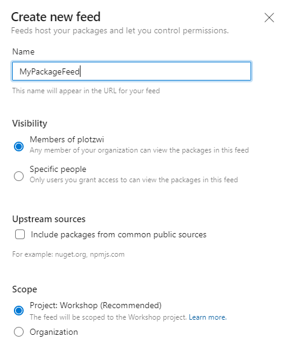

# Homework

### Create pipeline which uploads nuget package to feed.

## Create new feed

* Go to Artifacts and click Create Feed
* Select name, uncheck upstream sources (because it would detect package with same name in public nuget feed) and click Create

## Create Pipeline to build and upload package

### Easy way 

* Go to Pipelines, click New Pipeline in the right upper corner.
* Select Azure Repos Git and next select Existing Azure Pipelines YAML file
* Select branch `solution/feed-package` and path `/.azure-pipelines/publish-package` then click Continue
* Click Run

### More ambitious way

If you already feel comfortable with Azure DevOps and you have some basic dotnet knowledge, you can try to create this pipeline from scratch. Just instead of Existing Azure Pipelines YAML select Starter pipeline and try to build it by yourself ;) 

## Check if package was uploaded

Go to Artifacts, select your feed from the listbox and check if your package is present.

